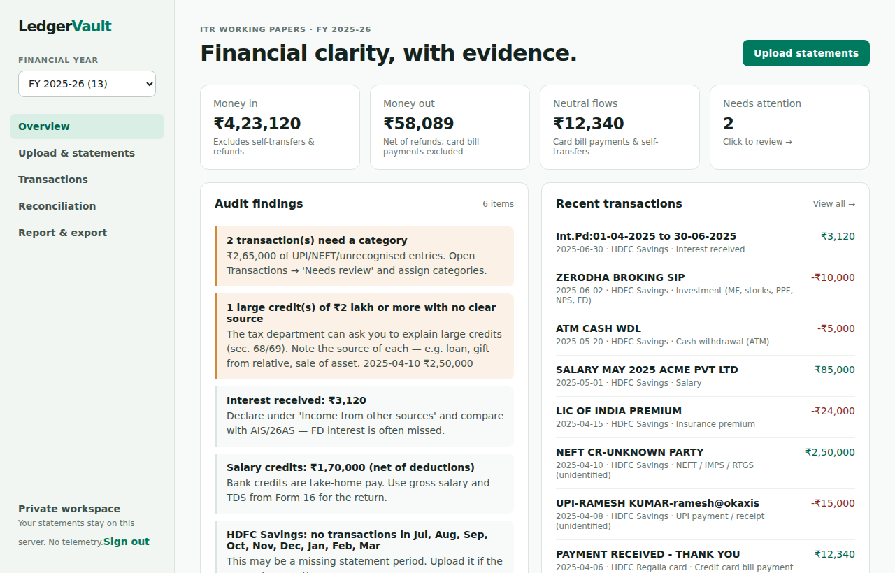
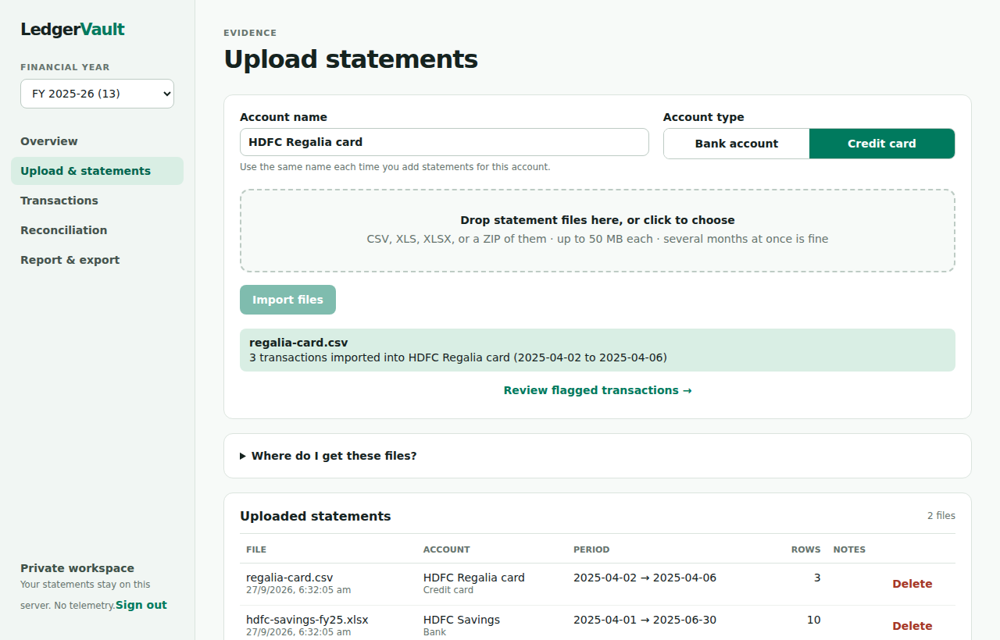
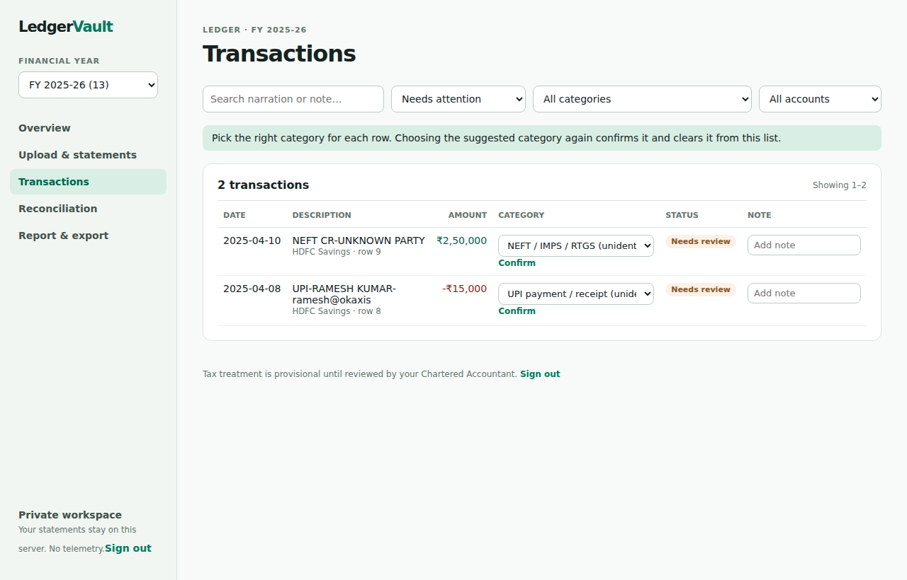
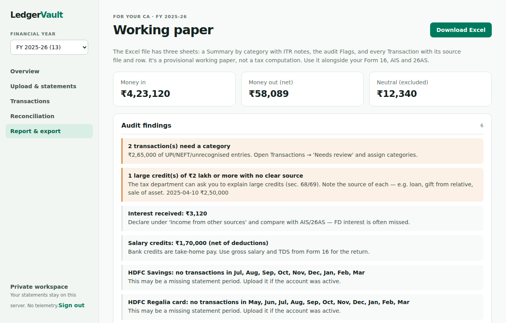

# LedgerVault

**Turn a year of bank and credit-card statements into a clean, CA-ready ITR working paper, on your own server.**

Every tax season you download statements from four banks, scroll through thousands of rows, and your CA still asks *"what was this ₹2.5 lakh credit in April?"*. LedgerVault does the tedious part. Drop in your statements and it categorises every transaction, cancels out card bill payments and transfers between your own accounts so nothing is counted twice, flags what the tax department is likely to ask about, and hands you an Excel file your CA will actually like.

It's self-hosted, so your financial data never leaves your machine or server.



---

## What it does for you

- **Understands Indian bank exports.** HDFC, ICICI, SBI, Axis, Kotak and similar CSV/Excel statements work as downloaded. It skips the account-details header block, handles "Withdrawal Amt." / "Deposit Amt." or Amount + Dr/Cr columns, lakh-style numbers, multi-line narrations and footer totals.
- **Categorises automatically.** Salary, interest, dividends, rent, insurance, investments, EMIs, tax payments, utilities, food, shopping, travel and more. Anything it can't identify (like a UPI transfer to a person) goes to a review queue instead of being guessed.
- **Never double-counts.** Paying your credit-card bill isn't an expense; the purchases on the card are. LedgerVault matches each bank payment to the card statement and does the same for transfers between your own accounts.
- **Runs an audit for you.** It flags things you'd rather hear from it than from a tax notice:
  - large credits with no clear source
  - cash deposits and card spend approaching the ₹10 lakh SFT reporting limits
  - interest and dividends you must declare
  - card bills paid with no card statement uploaded
  - months missing from a statement
- **Keeps every number traceable.** Each transaction remembers the file and row it came from. Re-uploading a file does nothing, and overlapping statements only add the new rows.
- **Hands off cleanly.** One click downloads an Excel working paper with a category summary and ITR notes, the audit flags, and every transaction with its source.
- **Private by design.** No cloud, no telemetry, no AI calls. Only the first person to sign up gets an account unless you open registration.

| Upload | Review | Report |
|---|---|---|
|  |  |  |

> **Not tax advice.** LedgerVault prepares a working paper; it doesn't file returns or decide what's deductible. ITR notes are prompts for you and your CA to check.

---

## Get started

You need [Docker](https://docs.docker.com/get-docker/). Everything else runs inside containers.

### Try it on your laptop (about 2 minutes)

```sh
git clone https://github.com/ethicaladitya/ledger-vault-quick-audit.git ledgervault
cd ledgervault
./setup.sh
```

Open **http://localhost**, create your account, and click **Try with sample data** to see it in action, or go straight to **Upload statements**.

### Put it on your own server (with HTTPS)

On an Ubuntu server whose domain (e.g. `ledger.example.com`) already points at it:

```sh
git clone https://github.com/ethicaladitya/ledger-vault-quick-audit.git ledgervault
cd ledgervault
SITE_ADDRESS=ledger.example.com ./setup.sh
```

Visit `https://ledger.example.com` and create your account. **Sign up straight away**: the first account becomes the owner, and registration then closes.

### Update to a newer version

On the server: `git pull && ./deploy.sh`. From your laptop: `./remote-deploy.sh user@server /path/on/server ~/.ssh/key.pem`. Details below.

---

## Using it

1. **Download statements** for the financial year (1 April to 31 March) as **Excel or CSV**:

   | Bank | Where to find it |
   |---|---|
   | HDFC Bank | NetBanking → Accounts → Account Statement → Download as **XLS** or **Delimited** |
   | ICICI Bank | Bank Accounts → Account Statement → Download → **XLS** |
   | SBI | OnlineSBI / YONO → Account Statement → **Excel** |
   | Axis, Kotak, others | "Account statement" → **Excel/CSV** |

   PDF isn't supported yet (see [Roadmap](#roadmap)).
2. **Upload & statements**: name the account (e.g. *HDFC Savings*), choose **Bank account** or **Credit card**, and drop the files in. Several months or a ZIP at once is fine. Use the same name next time to add to that account.
3. **Upload your credit-card statements too**, so card bill payments cancel out and the real purchases are counted.
4. **Overview** shows money in and out and the **audit findings** for the year you pick in the sidebar.
5. **Transactions → Needs attention**: choose a category for each flagged row (or click **Confirm**), and add notes like *"loan from father"* for your CA.
6. **Reconciliation** shows which card payments and transfers were matched, and what's still missing.
7. **Report & export → Download Excel**, and send it to your CA with your Form 16, AIS and 26AS.

---

## What's in this repo

### The scripts: which one do I run?

| Script | Run it… | What it does |
|---|---|---|
| **`setup.sh`** | **Once**, on a new machine or server | Installs Docker if it's missing (Ubuntu), creates `.env` with freshly generated random passwords and secrets, then calls `deploy.sh` to start everything. It never overwrites an existing `.env`, so re-running it is safe. |
| **`deploy.sh`** | **On the server**, every time you update | Rebuilds and restarts the app with `docker compose`, then waits until the API reports healthy and prints `LedgerVault deployed and healthy.`. Your data is kept, and database upgrades run automatically on start. It warns if `SITE_ADDRESS` is missing (meaning no HTTPS). |
| **`remote-deploy.sh`** | **On your laptop**, to update a server | Copies only the files tracked by git to the server (never `.env`, keys, or personal files lying in the folder), then runs `deploy.sh` there. It refuses to run if the server folder has no `.env` (so it can't start a second, empty copy), if `SITE_ADDRESS` isn't set, or if you have uncommitted changes. Usage: `./remote-deploy.sh ubuntu@1.2.3.4 /home/ubuntu/ledgervault ~/key.pem` |

In short: **`setup.sh` the first time, then `deploy.sh` (on the server) or `remote-deploy.sh` (from your laptop) for every update.**

### The configuration

| File | What it is |
|---|---|
| **`.env`** | Your private settings: database password, session secret, domain. Created by `setup.sh`, and never committed (it's in `.gitignore`). |
| **`.env.example`** | A template showing every setting, for when you want to write `.env` by hand. |
| **`docker-compose.yml`** | Defines the four containers and how they connect (see below). Only Caddy is exposed to the internet. |
| **`Caddyfile`** | Web server config: automatic HTTPS for `SITE_ADDRESS`, security headers, a 60 MB upload limit, and `noindex` so search engines stay away. |

#### Settings in `.env`

| Setting | Meaning |
|---|---|
| `POSTGRES_DB`, `POSTGRES_USER`, `POSTGRES_PASSWORD`, `DATABASE_URL` | Database name and credentials. Generated for you. |
| `JWT_SECRET` | Signs login sessions. Must be 32+ random characters; the app refuses to start with a placeholder. |
| `SITE_ADDRESS` | Your domain, e.g. `ledger.example.com`, which gets a free HTTPS certificate automatically. Leave it empty to serve `http://localhost`. |
| `ALLOW_REGISTRATION` | `false` (default): only the first person can sign up. `true`: anyone who can reach the site can create their own private workspace. |

### The four containers

```
 browser ──HTTPS──▶ caddy ──▶ web (Next.js UI) ──/api──▶ api (FastAPI) ──▶ db (PostgreSQL)
```

| Service | Role |
|---|---|
| `caddy` | Terminates HTTPS and gets certificates automatically. The only thing listening on ports 80 and 443. |
| `web` | The user interface. Also forwards `/api/*` requests to the API. |
| `api` | Does the real work: login, parsing statements, categorising, matching, reports and Excel export. |
| `db` | PostgreSQL. Your data lives in the `postgres-data` Docker volume and survives restarts and updates. |

### The code

| Folder | Contents |
|---|---|
| `backend/app/services/ingestion.py` | Reads CSV/XLS/XLSX/ZIP, finds the header row, maps bank column names, parses dates and amounts |
| `backend/app/services/rules.py` | The categories, their ITR notes, and the narration rules that assign them |
| `backend/app/services/reconciliation.py` | Matches card bill payments and self-transfers across accounts |
| `backend/app/services/report.py` | Year totals, audit findings and the Excel export |
| `backend/app/main.py` | The HTTP API |
| `backend/app/migrate.py` | Automatic, repeatable database upgrades on start |
| `backend/tests/` | Tests for parsers, API flows, privacy isolation between accounts, and login lockdown |
| `web/app/` | The UI: `page.tsx` (login and layout), `views.tsx` (screens), `style.css` |
| `sample-data/` | Tiny made-up statements used by **Try with sample data** |

---

## Privacy & security

- **Your data stays with you.** Statements are processed and stored only on your server. No telemetry, analytics or third-party calls.
- **Accounts are isolated.** Every page and API call is scoped to your own workspace, and tests check that one user can't see or change another's data.
- **Locked down by default.** Registration closes after the first account. Logins are rate-limited, passwords are hashed with scrypt, API docs are disabled, containers run as non-root users, and search engines are told not to index the site.
- **Never commit personal files.** `.gitignore` blocks `.env`, `*.pem` keys and statement formats (`*.csv` outside `sample-data/`, `*.xls`, `*.xlsx`, `*.pdf`, `*.zip`).

**Back up your data** (run on the server, in the app folder):

```sh
docker compose exec -T db pg_dump -U ledgervault ledgervault > ledgervault-backup-$(date +%F).sql
```

---

## FAQ

**My bank's file says "Couldn't find a header row".**
The parser looks for a Date column, a Narration/Description column, and Debit/Credit or Amount columns. If your bank names them differently, open an issue with the header row only (no transactions), or add the names to `COLUMNS` in `backend/app/services/ingestion.py`.

**Can my CA log in?**
Set `ALLOW_REGISTRATION=true`, run `./deploy.sh`, and they can create an account. Note that it is a separate, empty workspace for now; shared CA access is on the roadmap. Until then, send them the Excel export.

**Does it work for business or F&O income?**
It will categorise the bank side, but capital gains, business books and F&O statements are out of scope. Your CA still needs your broker's P&L reports.

**What does "Needs attention" mean?**
Either the category is unclear (UPI or NEFT to a person, an unknown narration), or a card payment or transfer has no matching entry on another uploaded statement.

---

## Development

```sh
# API on http://localhost:8000 (uses SQLite locally)
cd backend && pip install -r requirements-dev.txt && uvicorn app.main:app --reload

# UI on http://localhost:3000
cd web && npm install && API_URL=http://localhost:8000 npm run dev

# Tests
cd backend && pytest -q
```

See [ARCHITECTURE.md](ARCHITECTURE.md) for the data model, matching rules and security model.

## Roadmap

1. PDF statements, including password-protected ones
2. AIS / 26AS / Form 16 import, with bank credits reconciled against AIS
3. Shared CA access with question threads on individual transactions
4. Encrypted backups and encryption at rest

Contributions welcome, especially **synthetic** sample statements from banks that aren't recognised yet. Never share real ones.
